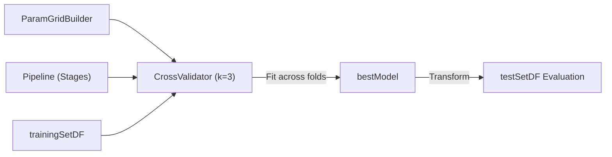

# Cheat Sheet: PD3 - Power Plant Output Prediction & Spark ML Pipelines

Reference guide covering end-to-end Machine Learning with PySpark ML: custom schemas, VectorAssembler feature pipelines, Linear Regression, Decision Trees, Random Forests, Cross-Validation, residual error analysis, and regression evaluation metrics.

---

## 1. Setup & Environment Imports

Standard imports for Spark ML pipelines:

```python
import findspark
findspark.init()

import sys
sys.path.append('..')
import testmti850

from pyspark.sql import SparkSession
from pyspark.sql.types import StructType, StructField, DoubleType
from pyspark.sql.functions import col, lit, round

# Spark ML Feature Engineering & Pipeline
from pyspark.ml.feature import VectorAssembler
from pyspark.ml import Pipeline

# Spark ML Regressors
from pyspark.ml.regression import (
    LinearRegression,
    DecisionTreeRegressor,
    RandomForestRegressor
)

# Spark ML Evaluation & Hyperparameter Tuning
from pyspark.ml.evaluation import RegressionEvaluator
from pyspark.ml.tuning import ParamGridBuilder, CrossValidator

spark = SparkSession.builder \
    .master("local[*]") \
    .appName("PD3-PowerPlantPrediction") \
    .getOrCreate()
```

---

## 2. Data Ingestion & Custom Schema Definition

Defining explicit schemas with `StructType` to prevent automatic type inference overhead:

```python
# CCPP Dataset: 5 continuous variables
# AT (Ambient Temperature), V (Exhaust Vacuum), AP (Ambient Pressure),
# RH (Relative Humidity), PE (Net Hourly Electrical Energy Output - Target)

customSchema = StructType([
    StructField("AT", DoubleType(), True),
    StructField("V", DoubleType(), True),
    StructField("AP", DoubleType(), True),
    StructField("RH", DoubleType(), True),
    StructField("PE", DoubleType(), True)
])

# Read CSV with schema applied
powerPlantDF = spark.read.csv(
    "CCPP.csv",
    sep=",",
    header=True,
    schema=customSchema
)

# Register temporary SQL view
powerPlantDF.createOrReplaceTempView("power_plant")
```

---

## 3. Spark SQL & Data Exploration

Querying tables lazily using Spark SQL:

```python
# Summary statistics for all columns
df = spark.table("power_plant")
df.describe().show()

# Querying via SQL
sqlDF = spark.sql("SELECT AT, PE FROM power_plant WHERE AT > 20")
sqlDF.show(5)
```

---

## 4. Matplotlib Visualizations

Converting Spark DataFrames to NumPy / Matplotlib for plotting:

```python
import matplotlib.pyplot as plt

# Extract data using collect() and zip
data = spark.sql("SELECT AT, PE FROM power_plant").collect()
temp, power = zip(*data)

# Scatter plot
fig, ax = plt.subplots(figsize=(8, 5))
ax.scatter(temp, power, color='crimson', s=1, alpha=0.5)
ax.set_title("Correlation between Power and Temperature")
ax.set_xlabel("Ambient Temperature (C)")
ax.set_ylabel("Power Output (MW)")
plt.tight_layout()
plt.show()
```

---

## 5. Feature Engineering: `VectorAssembler`

Spark ML requires all independent features to be assembled into a single vector column:

```python
datasetDF = spark.table("power_plant")

vectorizer = VectorAssembler()
vectorizer.setInputCols(["AT", "V", "AP", "RH"])
vectorizer.setOutputCol("features")

# Resulting schema contains original columns plus 'features' (DenseVector)
```

---

## 6. Train/Test Split & Caching

Splitting data deterministically with a random seed:

```python
# Split 20% test, 80% training
seed = 1800009193
(split20DF, split80DF) = datasetDF.randomSplit([0.20, 0.80], seed=seed)

# Cache DataFrames to avoid recomputing the split across multiple model runs
testSetDF = split20DF.cache()
trainingSetDF = split80DF.cache()

print(f"Training count: {trainingSetDF.count()}")
print(f"Test count: {testSetDF.count()}")
```

---

## 7. Model 1: Linear Regression & Pipeline

### Pipeline Construction and Fitting
```python
# Instantiate Linear Regression
lr = LinearRegression()
lr.setPredictionCol("Predicted_PE") \
  .setLabelCol("PE") \
  .setMaxIter(100) \
  .setRegParam(0.1)

# Assemble Pipeline: [vectorizer -> linear regression]
lrPipeline = Pipeline(stages=[vectorizer, lr])

# Fit model on training data
lrModel = lrPipeline.fit(trainingSetDF)
```

### Inspecting Model Parameters & Equation
```python
# Extract the trained LinearRegressionModel from the pipeline
lrModelStage = lrModel.stages[-1]

intercept = lrModelStage.intercept
weights = lrModelStage.coefficients

print("Model Equation:")
print(f"PE = {intercept:.2f} + ({weights[0]:.2f} * AT) + ({weights[1]:.2f} * V) + ({weights[2]:.2f} * AP) + ({weights[3]:.2f} * RH)")
```

---

## 8. Evaluation Metrics & Residual Error Analysis

### Evaluating with `RegressionEvaluator`
```python
# Generate predictions on test data
predictionsDF = lrModel.transform(testSetDF)

# Compute Root Mean Squared Error (RMSE)
regEval = RegressionEvaluator(
    predictionCol="Predicted_PE",
    labelCol="PE",
    metricName="rmse"
)
rmse = regEval.evaluate(predictionsDF)

# Compute Coefficient of Determination (R^2)
r2 = regEval.evaluate(predictionsDF, {regEval.metricName: "r2"})

print(f"RMSE: {rmse:.2f} MW")
print(f"R2 Score: {r2:.2f}")
```

### Metric Interpretations
* **RMSE ($4.43$ MW)**: Average standard deviation of the residuals. On average, predictions deviate by $\pm 4.43$ MW from actual output.
* **$R^2$ ($0.93$)**: $93\%$ of the variance in power output is explained by the 4 features.

### Residual Error Analysis (Gaussian Assumption)
For a well-fitted model with normally distributed errors:
* $\approx 68\%$ of errors fall within $\pm 1 \times \text{RMSE}$
* $\approx 95\%$ of errors fall within $\pm 2 \times \text{RMSE}$

```python
# Standardize residual error: (actual - predicted) / RMSE
predictionsDF.selectExpr(
    "PE", "Predicted_PE",
    "PE - Predicted_PE AS Residual_Error",
    f"(PE - Predicted_PE) / {rmse} AS Within_RMSE"
).createOrReplaceTempView("Power_Plant_RMSE_Evaluation")

# Histogram of standardized residuals using Pandas
rmseDF = spark.sql("SELECT Within_RMSE FROM Power_Plant_RMSE_Evaluation")
rmseDF_pd = rmseDF.select("Within_RMSE").toPandas()
rmseDF_pd.plot.hist(bins=100, title="Residual Error Distribution")
plt.xlabel("Multiples of RMSE")
plt.show()
```

---

## 9. Hyperparameter Tuning with `CrossValidator`

### K-Fold Cross-Validation Workflow
`CrossValidator` splits training data into $K$ folds, trains on $K-1$ folds, evaluates on the hold-out fold, and selects the model configuration yielding the lowest average metric.



### Tuning Linear Regression (`regParam`)
```python
crossval = CrossValidator(estimator=lrPipeline, evaluator=regEval, numFolds=3)

# Test 10 regularization parameter values from 0.01 to 0.10
regParam = [x / 100.0 for x in range(1, 11)]

paramGrid = (ParamGridBuilder()
             .addGrid(lr.regParam, regParam)
             .build())

crossval.setEstimatorParamMaps(paramGrid)
cvModel = crossval.fit(trainingSetDF).bestModel
```

---

## 10. Model 2: Decision Tree Regressor

Decision trees handle non-linear boundaries by segmenting data into feature-based splits:

```python
# Instantiate Decision Tree
dt = DecisionTreeRegressor()
dt.setLabelCol("PE") \
  .setPredictionCol("Predicted_PE") \
  .setFeaturesCol("features") \
  .setMaxBins(100)

dtPipeline = Pipeline(stages=[vectorizer, dt])

# Grid search over maxDepth
# Note: Depth 5 is needed to reach RMSE 4.35 and R2 0.93
crossval.setEstimator(dtPipeline).setEvaluator(regEval)

paramGrid = (ParamGridBuilder()
             .addGrid(dt.maxDepth, [2, 3, 5])
             .build())

crossval.setEstimatorParamMaps(paramGrid)
dtModel = crossval.fit(trainingSetDF).bestModel

# Evaluate on test set
dtPreds = dtModel.transform(testSetDF)
rmseDT = regEval.evaluate(dtPreds)
r2DT = regEval.evaluate(dtPreds, {regEval.metricName: "r2"})

# Print tree rules structure
print(dtModel.stages[-1]._java_obj.toDebugString())
```

---

## 11. Model 3: Random Forest Regressor (Ensemble)

Random Forests construct an ensemble (committee) of randomized decision trees via bootstrap aggregation (bagging), reducing prediction variance:

```python
rf = RandomForestRegressor()
rf.setLabelCol("PE") \
  .setPredictionCol("Predicted_PE") \
  .setFeaturesCol("features") \
  .setSeed(100088121) \
  .setMaxDepth(8) \
  .setNumTrees(30)

rfPipeline = Pipeline(stages=[vectorizer, rf])

# Tuning maxBins (discretization granularity)
crossval.setEstimator(rfPipeline)

paramGrid = (ParamGridBuilder()
             .addGrid(rf.maxBins, [50, 100])
             .build())

crossval.setEstimatorParamMaps(paramGrid)
rfModel = crossval.fit(trainingSetDF).bestModel

# Evaluate on test set
rfPreds = rfModel.transform(testSetDF)
rmseRF = regEval.evaluate(rfPreds)
r2RF = regEval.evaluate(rfPreds, {regEval.metricName: "r2"})
```

---

## 12. Final Performance Comparison Summary

| Model Algorithm | RMSE (Test Error) | $R^2$ Score | Key Characteristics |
| :--- | :---: | :---: | :--- |
| **Linear Regression** | $4.43$ MW | $0.93$ | Fast, highly interpretable, assumes linear relationships |
| **Decision Tree** | $4.35$ MW | $0.93$ | Captures non-linear thresholds, prone to overfitting if depth is high |
| **Random Forest (30 trees)** | **$3.61$ MW** | **$0.95$** | Ensemble averaging, lowest variance, best overall accuracy |
